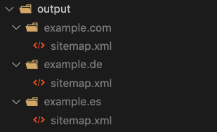

# Sitemap generator
A NodeJS script to generate a sitemap.xml or several ones (with its sitemap index also) if the input is greater than 50.000 URLs.

## Requirements
* NodeJS installed
* Npm or Yarn to run the script

## How to generate a sitemap.xml?
1. Add your URLs in `./src/data/input/urls.txt`
2. Execute `Yarn`or `npm install`to install the dependencies
3. Execute the script in the command line `$ yarn run execute SITEMAP_NAME`(i.e. `yarn run execute sitemap-blog`)
4. Done!

The output will be under the path: `./src/data/output`

### How to split the sitemaps by domain (or other rules)?
If, instead of creating a set of sitemaps for the same domain, you are creating several ones for different domains, TLDs or subdomains you can group them by a regexp pattern.

For example, let's imagine that we have three different sites:
* https://example.com
* https://example.es
* https://example.de

By default it will create a sitemap like this:

```xml
<?xml version="1.0" encoding="UTF-8"?>
<urlset xmlns="http://www.sitemaps.org/schemas/sitemap/0.9">
	<url>
		<loc>https://example.com</loc>
	</url>
	<url>
		<loc>https://example.es</loc>
	</url>
	<url>
		<loc>https://example.com/example-path</loc>
	</url>
	<url>
		<loc>https://example.es/other-path</loc>
	</url>
	<url>
		<loc>https://example.de</loc>
	</url>
</urlset>
```

If I wanted to have different sitemaps per domain I'd need to modify the regexp `('')` to `('example\..*')` in `./src/services/GenerateSitemapService.js` in the `line 64`. 

The method is called `_getTlds`:
```js
_getTlds(urls) {
    const domains = urls.map(url => {
      return new URL(url).host.match('')[0] // modify this regex to classify the urls in directories
    })

    return [...new Set(domains)]
  }
```

When executed, the output will be a set of folders using the name of each domain:




## Additional notes
* The first argumment after the script is the name of the sitemap(s) (every extra sitemap will be with a numerical increase)
* Be careful with the regexp to split the sitemaps as it can create a lot of folders if it's not well tested

If your list of URLs is superior than 50.000, the script will create several sitemaps (once per 50.000 URLs). Also it will create the sitemap index linking to those sitemaps, maybe you'll need to update the path in the sitemap index.